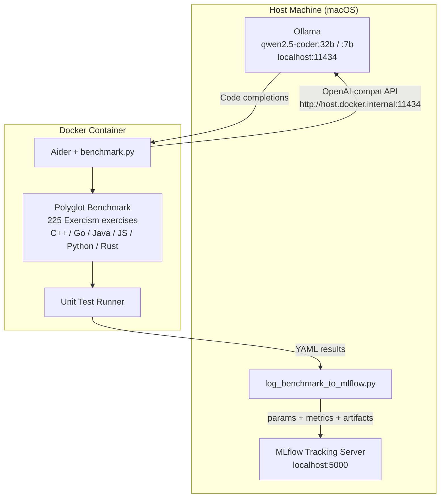
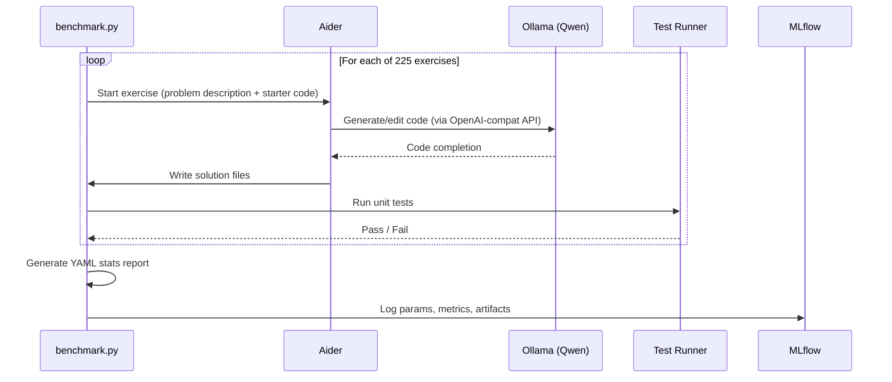

# Benchmarking Architecture

## Overview

The benchmarking pipeline evaluates locally-run Qwen LLMs on coding tasks from the [Aider polyglot benchmark](https://aider.chat/2024/12/21/polyglot.html) (225 Exercism exercises across 6 languages). Results are tracked in MLflow for experiment comparison.

## System Diagram

## Data Flow

## Key Configuration

| Setting           | Value                               | Notes                                       |
| ----------------- | ----------------------------------- | ------------------------------------------- |
| Ollama API        | `http://host.docker.internal:11434` | Docker → host connectivity (macOS)          |
| Context window    | ≥8192 tokens                        | Ollama default 2K is too small for Aider    |
| Edit format       | `whole`                             | Recommended starting point for local models |
| MLflow experiment | `aider-polyglot-benchmark`          | Groups all benchmark runs                   |
