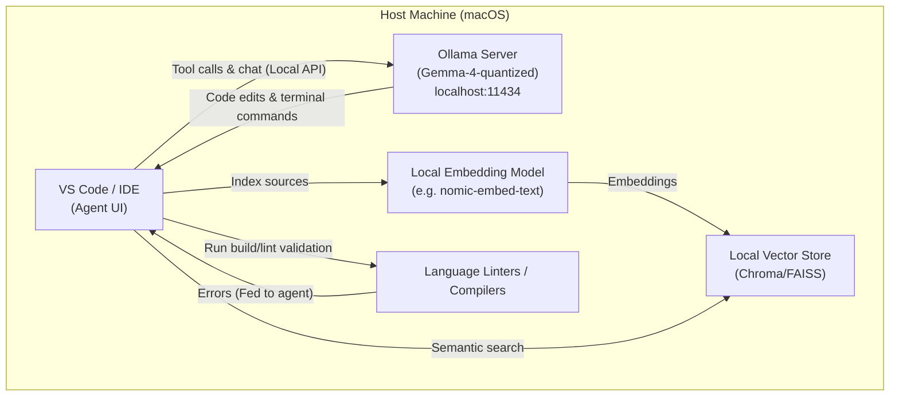
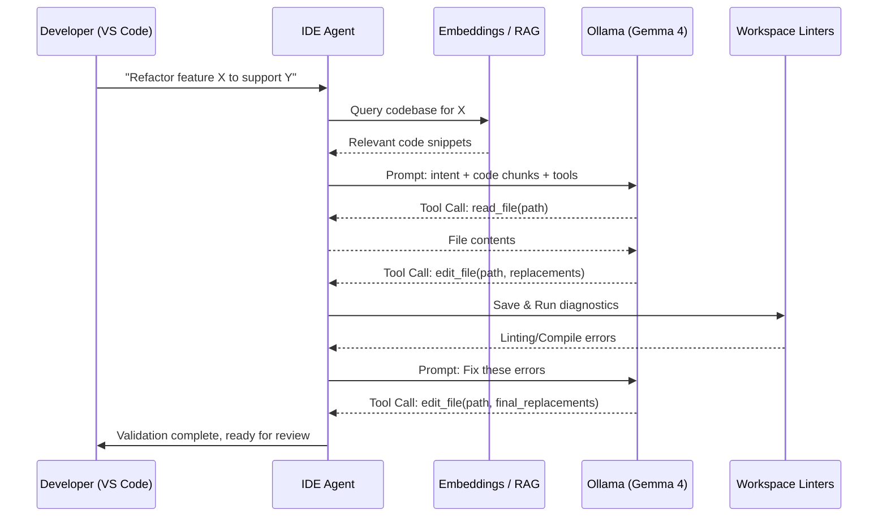
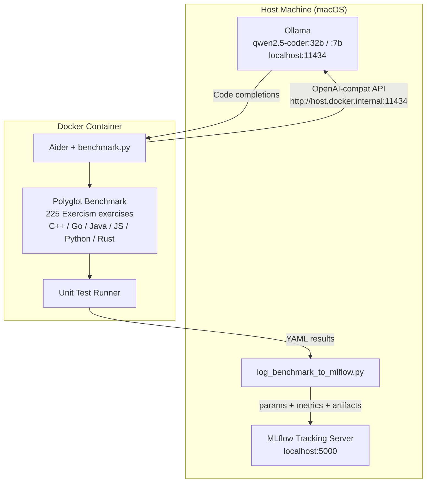
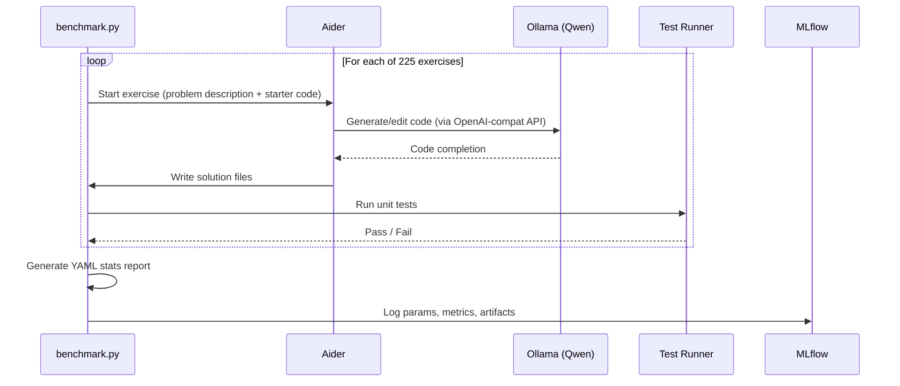

# System Architecture

## Overview

The thesis currently evaluates an entirely private, local agentic workflow utilizing locally-run quantized models (e.g., Gemma 4). It evaluates autonomous agent abilities such as multi-step refactoring, linter loops, and project orchestration using IDE-native extensions (like Continue/Aider).

## Agentic IDE Architecture

## Agentic Workflow Data Flow

## Benchmarking Architecture (Legacy / Polyglot)

## System Diagram

## Data Flow

## Key Configuration

| Setting           | Value                               | Notes                                       |
| ----------------- | ----------------------------------- | ------------------------------------------- |
| Ollama API        | `http://host.docker.internal:11434` | Docker → host connectivity (macOS)          |
| Context window    | ≥8192 tokens                        | Ollama default 2K is too small for Aider    |
| Edit format       | `whole`                             | Recommended starting point for local models |
| MLflow experiment | `aider-polyglot-benchmark`          | Groups all benchmark runs                   |
